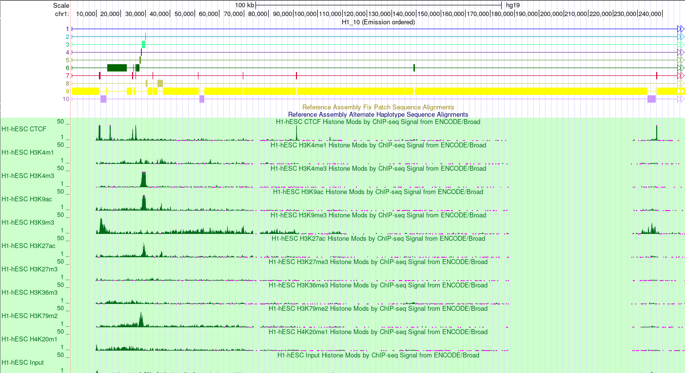
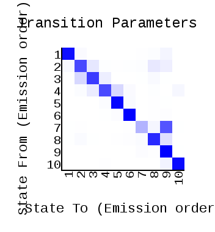
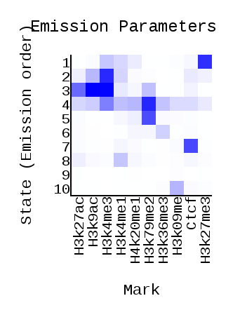
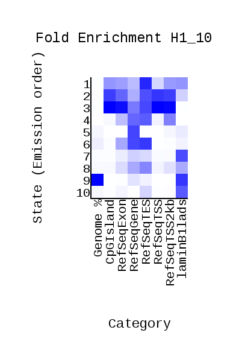
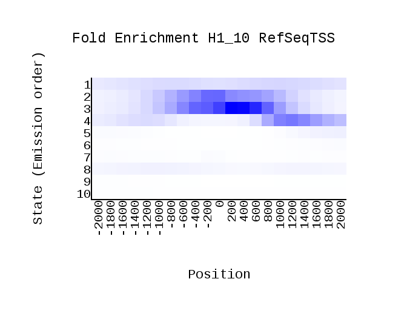
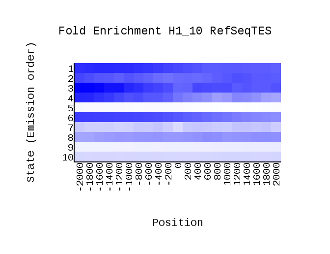
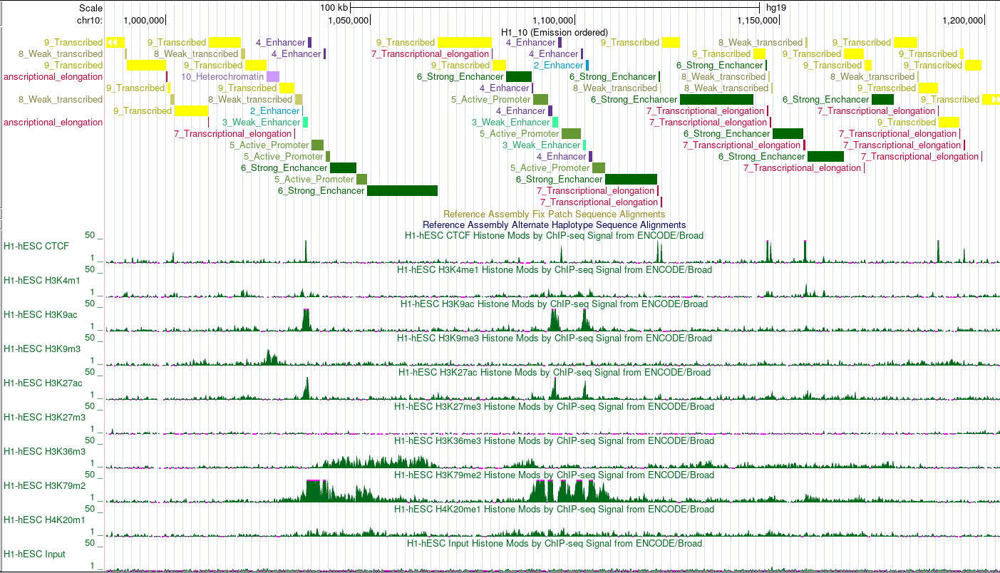

# hse_hw3_chromhmm
Колаб - https://colab.research.google.com/drive/1VWyAgje-xw_nALgWjjNT8X8p3AuYAnNc?usp=sharing

Клеточная линия - H1 (H1-hESC)  
| Линия | Метка | Файл с меткой | Файл с контролем |
| ---- | ------- | ------------ | --------------- | 
| H1 | Ctcf | Ctcf.bam | Control.bam |
| H1 | H3k09me3 | H3k09me3.bam | Control.bam |
| H1 | H3k4me1 | H3k4me1.bam | Control.bam |
| H1 | H3k9ac | H3k9ac.bam | Control.bam |
| H1 | H3k27ac | H3k27ac.bam | Control.bam |
| H1 | H4k20me1 | H4k20me1.bam | Control.bam |
| H1 | H3k79me2 | H3k79me2.bam | Control.bam |
| H1 | H3k36me3 | H3k36me3.bam | Control.bam |
| H1 | H3k27me3 | H3k27me3.bam | Control.bam |
| H1 | H3k4me3 | H3k4me3.bam | Control.bam |   


# Данные из геномного браузера


# ChromHMM  
transition  
  
emmission  
  
overlap  
  
RefSeqTSS  
  
RefSeqTES  
  

| Номер | Название | Метки | Аннотация |
| --- | -------- | ------------------- | --- |
| 1 | Неактивный промотор | H3K27me3 | Чаще всего пересекается с аннотацией  неактивного промотора (3).Часто встречаются в репрессированных генах, находящихся в гетерохроматине (DMRT1, DMRT2, DMRT3) в данной клеточной линии  |
| 2 | Слабый промотор | H3K4me3, H3K9ac | встречаются перед стабильно экспрессирующимися (JAK2, CD274) в данной линии генами |
| 3 | Активный промотор | H3K4me3, H3K9ac | Полностью соответствует состоянию активного промотора (1). Находится перед конститутивно экспрессирующимися генами (UHFR2, RANBP6)   |
| 4 | Слабый промотор | H3K79me2, H3K4me3 | Чаще всего соответствует только какой-то части слабого промотора(2).   |
| 5 | Сигнал перехода к элонгации | H3K79me2 | Cоответствует аннотациям Txn_transition (9). Судя по положению в начале рамки считывания после промотора данный регион отвечает за инициацию транскрипции и переход к трансляции. |
| 6 | Активная элонгация | H3K36me3 | Соответствует аннотации областей элонгации (10). Видимо такое состояние модификаций характерно для активно экспрессирующихся генов, т.к. рассмотренный ген CD46 является одним ои основных маркеров линии эмбриональных стволовых клеток человека, это подтверждается высокой плотность РНК-секвенирования в области данного гена.   |
| 7 | Инсулятор | CTCF | Соответствует инсуляторным областям (8) в гетерохроматине. Экспрессия с данного региона низкая.  |
| 8 | Энхансер | H3K4me1 | Соответствует энхансерной области (7/6). Слабые промоторы могут быть окружены несколькими энхансерами для большего контроля экспрессии.  |
| 9 | Слабая элонгация | ..... | Наиболее стандартное состояние слабо-средне экспрессирующихся генов, которые могут находиться в гетерохроматине.  Соответствует отсутствию или незначительному уровню рассматриваемых меток |
| 10 | Слабый энхансер в гетерохроматине | H3K9me3 |  Вероятно, соответствует слабым энхансерам или другим структурам молчащих регионов геторохроматина. Ассоциирован с ламиной, поэтому репрессирован. |

## Бонус 

```python
import pandas as pd
df = pd.read_csv('/content/drive/My Drive/H1_10_dense.bed', encoding='utf-8', sep='\t', comment='t', header=None)
#track name="H1_10" description="H1_10 (Emission ordered)" visibility=1 itemRgb="On"
header = ['chrom', 'chromStart', 'chromEnd', 'state', 'zero', 'dot', 'chromStart', 'chromEnd', 'rgb']
with open('H1_10_dense_edited.bed', "w") as file:
    file.write('track name="H1_10" description="H1_10 (Emission ordered)" visibility=1 itemRgb="On"\n')
    df.columns = header[:len(df.columns)]
    df.loc[df.state == 1, 'state'] = '1_Weak_Enhancer'
    df.loc[df.state == 2, 'state'] = '2_Enhancer'
    df.loc[df.state == 3, 'state'] = '3_Weak_Enhancer'
    df.loc[df.state == 4, 'state'] = '4_Enhancer'
    df.loc[df.state == 5, 'state'] = '5_Active_Promoter'
    df.loc[df.state == 6, 'state'] = '6_Strong_Enchancer'
    df.loc[df.state == 7, 'state'] = '7_Transcriptional_elongation'
    df.loc[df.state == 8, 'state'] = '8_Weak_transcribed'
    df.loc[df.state == 9, 'state'] = '9_Transcribed'
    df.loc[df.state == 10, 'state'] = '10_Heterochromatin'
    df.to_csv(file, sep='\t', index=False, header=None, mode="a")
```

